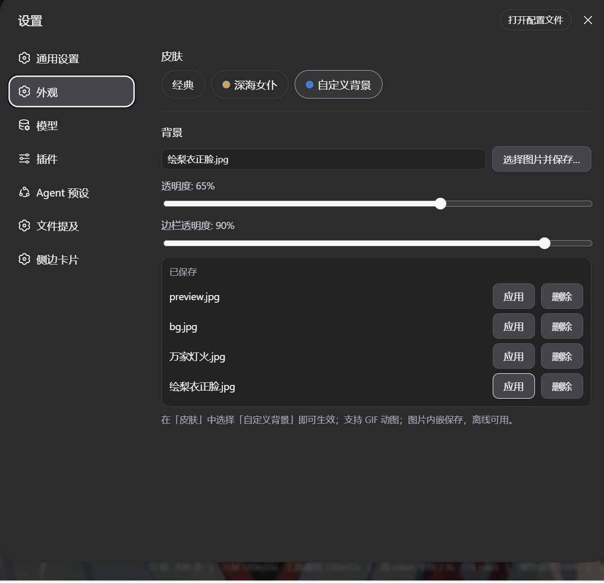

# dsh-skin-manager

DSH 皮肤管理器:在 DeepSeek Harness Web GUI 内**实时切换皮肤**,无需重启、无需刷新。同时拥有独立的外观设置页(与「通用」「模型」并列)。



- **经典皮肤(内置)** = DSH 官方默认外观,不加载任何皮肤效果;
- **注册式皮肤契约**:任意皮肤(自写或第三方)注册即接入 —— 激活、切换、持久化由管理器统一负责;
- **独立「外观」设置页**:设置 → **外观**,「皮肤」一行与其他外观项(如自定义背景)集中管理;
- 选择持久化在 Host 设置文档(`skin-manager.skin`),重启后自动恢复。

## 安装

```sh
dsh plugin --profile web add github:awfawafaf/dsh-skin-manager
```

本地开发安装:`dsh plugin --profile web add D:/ds_harness/plugins/projects/dsh-skin-manager`(会写成 `link:` 依赖,改代码重启即生效)。安装后**重启 dsh web**。

皮肤插件(如深海女仆、自定义背景)各自单独安装;管理器自动发现并列出已注册的皮肤。

## 使用

设置 → **外观** → 「皮肤」:点击皮肤芯片即切换,立即生效。再次打开 dsh 会记住上次选择。

## 皮肤契约(给皮肤作者)

一个皮肤就是一个 **client 插件**(`dsh.client.platform: web`),在 `apply()` 里通过 `skinManager` 服务注册自己:

```ts
import type { SkinDefinition } from 'dsh-skin-manager'

export const inject = ['skinManager']

export function apply(ctx: Context): void {
  ctx.effect(() => ctx.skinManager.register({
    id: 'my-skin',          // 稳定 id(kebab-case),持久化用
    label: '我的皮肤',       // 显示名(中文产品文案)
    labelEn: 'My Skin',     // 可选
    accent: '#c5a468',      // 可选:设置行色块
    order: 10,              // 可选:行内排序
    apply: () => {
      // 激活皮肤:写入 body 属性/内联样式/注入 DOM 与样式
      // 必须返回一个完整还原的 disposer
      return () => { /* 还原一切 */ }
    },
  }), 'my-skin: register')
}
```

规则与约定:

- **`apply()` 返回 disposer**,必须完整还原它写过的一切:body 属性、内联样式、注入的 DOM 节点、`<style>` 标签、标题/favicon 等;管理器在切换或卸载时会调用它。中途抛错时,已做的写入也要自行兜底清理(disposer 先于后续初始化建立)。
- **颜色只使用 `--dsw-alias-*` 语义 token**(或经 `skinManager` 之外的主题服务做 token 覆盖),不要写死颜色;`data-ds-skin="<id>"` 属性由管理器统一设置,纯 CSS 皮肤可基于它作用域化。
- 皮肤包与皮肤包之间互斥由管理器保证:同一时刻只有一个皮肤的 `apply()` 被调用。
- 皮肤卸载(插件移除)时,管理器自动回退到经典皮肤;设置文档保留旧值,重新安装后会自动恢复该皮肤。
- 明暗主题由产品主题服务管理,皮肤效果叠加在其上即可(跟随 `body[data-ds-dark-theme]`)。

## 开发

```sh
pnpm install
pnpm run typecheck   # tsc
pnpm test            # vitest
pnpm run build       # tsc 类型 + tsdown 产物 → lib/
```

产物:`lib/index.js`(host 半)+ `lib/client.js`(浏览器 bundle)+ `lib/types/`。`lib/` 提交进 git(profile `link:` 安装免构建)。

## 许可

MIT
